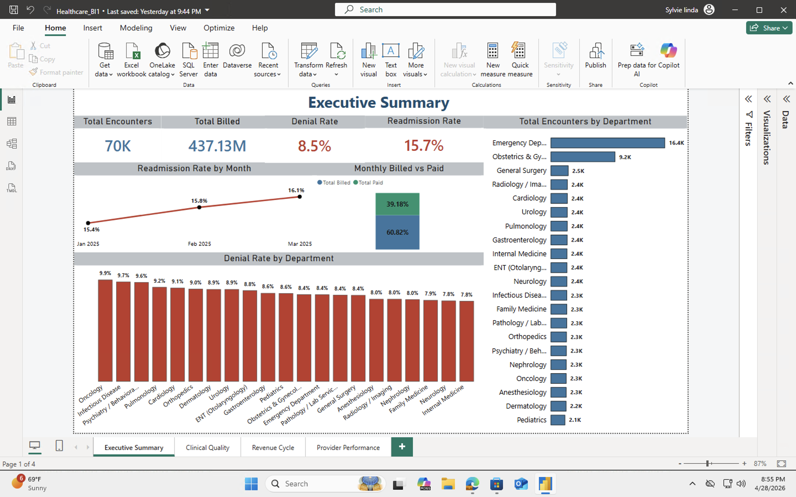
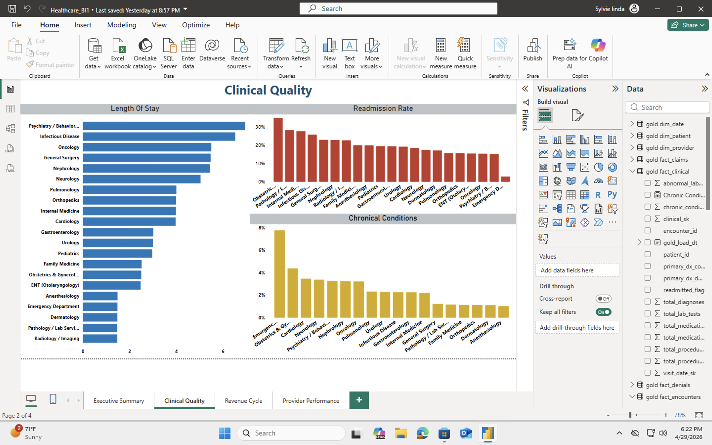
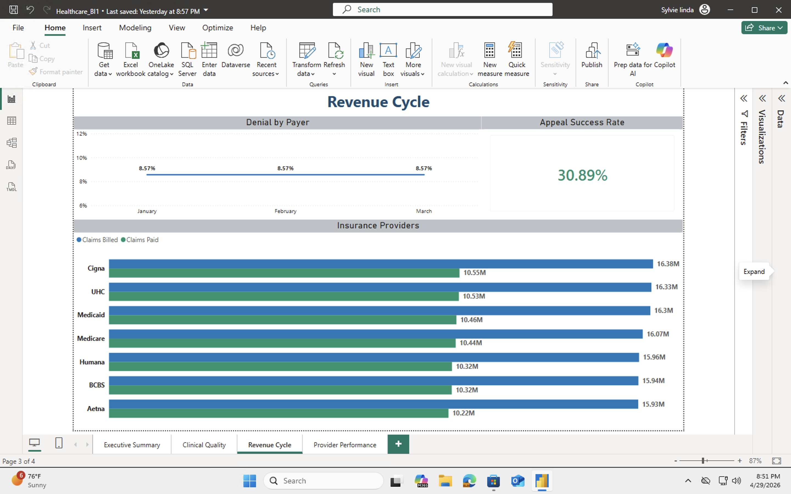

## 🏥 Healthcare Data Engineering & Analytics Platform
### Enterprise Case Study: Modernizing Healthcare KPI Reporting with Azure & Databricks
---

####  Gold Layer Data Model

**gold_fact_clinical** includes:
- `readmitted_flag`, `total_diagnoses`, `total_medications`
- `total_procedures`, `clinical_sk`, `primary_dx_code`

**gold_fact_claims** — revenue and denial tracking

**Dimension tables:** `gold_dim_patient`, `gold_dim_provider`, `gold_dim_date`

---
### 1. Executive Summary

Healthcare organizations often struggle with fragmented data sources, inconsistent KPI definitions, and delayed reporting for operational and clinical decision-making.

This project simulates an enterprise-grade data platform designed to unify healthcare data and deliver trusted, near-real-time executive insights using a modern lakehouse architecture.

The solution centralizes patient, encounter, provider, and claims data into a governed pipeline and delivers an Executive Summary dashboard used for high-level performance monitoring.

---
### 2. Business Problem

#### Healthcare stakeholders faced the following challenges:

- KPI inconsistencies (e.g., readmission rate definition varied across reports)
- Delayed reporting cycles for executive dashboards
- Fragmented datasets across operational systems
- Limited visibility into provider and clinical performance trends
- Business Objective

#### Build a unified analytics platform that:

- Standardizes healthcare KPIs
- Improves data reliability and traceability
- Enables faster executive decision-making
---
### 3. Solution Overview

A modern medallion architecture (Bronze → Silver → Gold) was implemented using Azure Data Factory and Databricks.

##### Architecture Flow
- Azure Data Factory → Data ingestion from raw healthcare sources
- Bronze Layer → Raw ingestion and initial storage
- Silver Layer → Data cleaning, validation, standardization
- Gold Layer → KPI aggregation and business-ready datasets
- Databricks → Executive dashboards
- Power BI → Executive dashboards and reporting layer

--- 
### 4. Executive Summary Dashboard (Power BI)

#### Dashboard Previews

**Executive Summary** — KPI overview across 70K encounters and $437M billed

**Clinical Quality** — Length of stay, readmission rates, and chronic conditions by department

**Revenue Cycle** — Denial trends by payer, appeal success rate, and insurance provider comparison

##### The dashboard enables:

- Faster identification of operational inefficiencies
- Standardized KPI interpretation across departments
- High-level visibility into healthcare system performance

---  

### 5. Databricks Implementation (Gold Layer Focus)
- Developed PySpark-based transformations for KPI aggregation
- Designed and optimized the fact_monthly_kpis gold table
- Used Delta Lake for reliability, versioning, and performance optimization
- Integrated Databricks SQL endpoints for BI consumption
- Leveraged AI-assisted tools (Databricks Genie) to accelerate exploration, validate logic, and refine KPI definitions during development
  
---
### 6. Key Design Decisions
- Adopted medallion architecture to enforce data quality progression
- Centralized KPI logic in the gold layer to avoid metric fragmentation
- Used Delta Lake for ACID compliance and historical traceability
- Separated transformation logic (Databricks) from visualization layer (Power BI)

--- 
### 7. Key Metrics Delivered

| KPI | Value |
|-----|-------|
| Total Encounters Analyzed | 70,000 |
| Total Billed | $437M |
| Overall Denial Rate | 8.5% |
| Readmission Rate (Mar 2025) | 16.1% (trending up from 15.4%) |
| Appeal Success Rate | 30.89% |
| Insurance Providers Tracked | 8 (Cigna, UHC, Medicare, Medicaid, etc.) |
| Dashboard Pages | 4 (Executive, Clinical Quality, Revenue Cycle, Provider Performance) |

---
### 8. Key Findings

- Readmission rates trended upward Jan–Mar 2025 (15.4% → 16.1%),  flagging a potential quality concern for clinical review
- Oncology and Infectious Disease had the highest denial rates (~9.7–9.9%)
- Psychiatry/Behavioral Health had the longest average length of stay (~6 days)
- Cigna had the largest gap between billed ($16.38M) and paid ($10.55M); a ~36% reduction worth investigating

---
### 9. Technologies Used
- Azure Data Factory
- Azure Data Lake
- Databricks (PySpark, Delta Lake, SQL)
- Power BI
- AI-assisted development (Databricks Genie)

---

### License

This project is licensed under the [MIT LICENSE](LICENSE). You are free to use, modify, and share this project with proper attribution.

---

### 👤 About Me

I'm **Sylvie Linda**, a data engineer specializing in cloud-native healthcare data pipelines on Azure. I design end-to-end solutions, from raw ingestion through medallion architecture transformations to executive-ready KPI dashboards using Azure Data Factory, Databricks, Delta Lake, and Power BI.

This project reflects my focus on building scalable, governed data platforms that turn fragmented healthcare data into trusted insights for clinical and operational decision-making.

📫 https://www.linkedin.com/in/sylvie-linda-85087416a/ | 📧 Lindasylvie6@email.com
