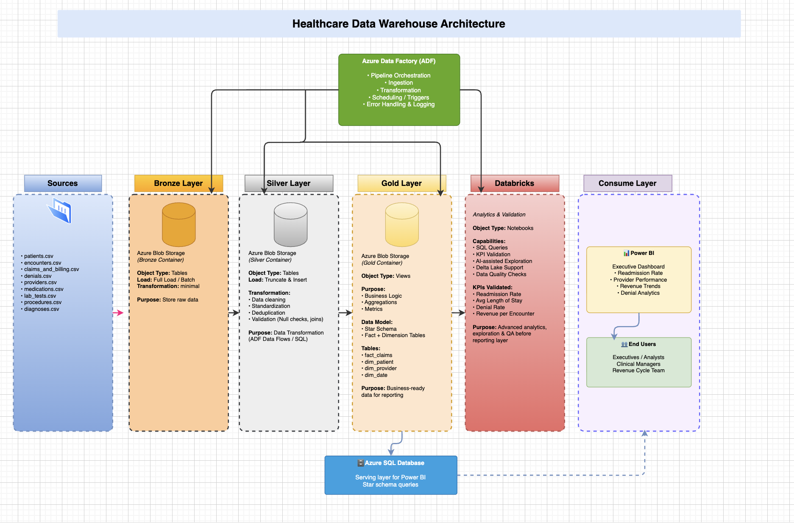
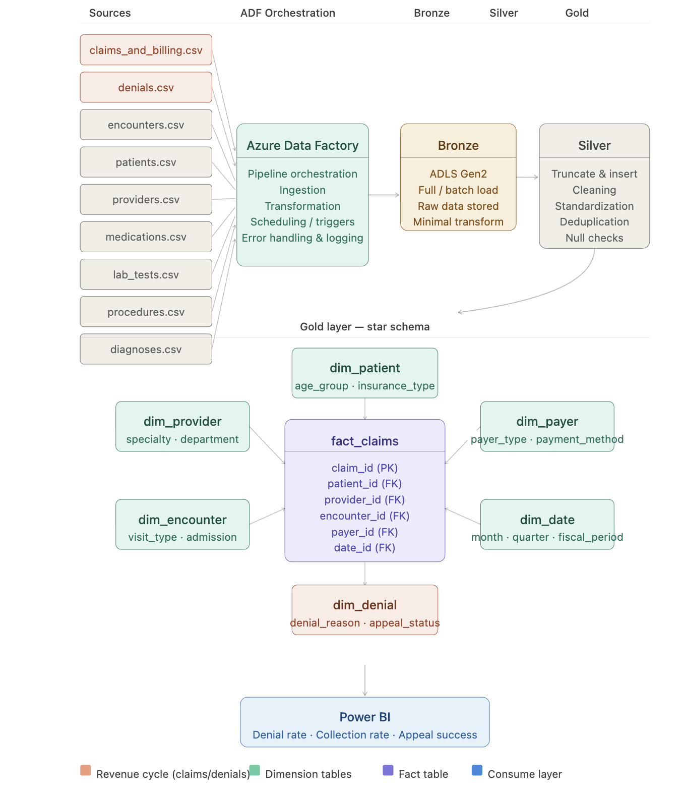
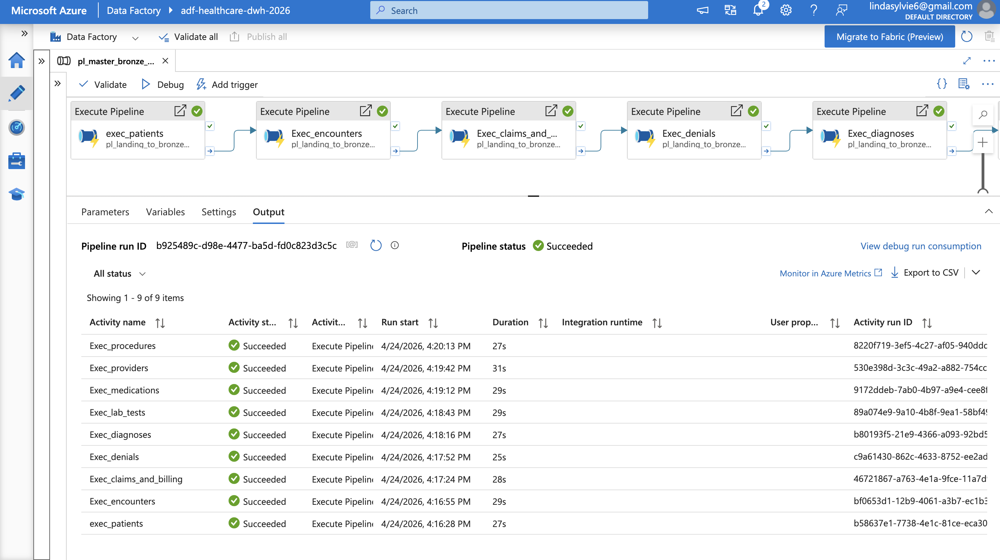
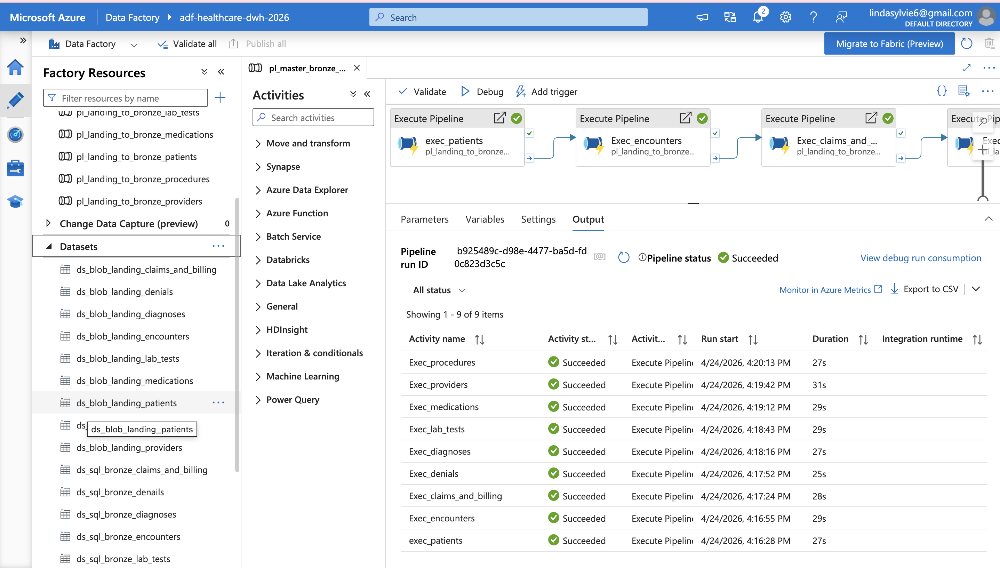
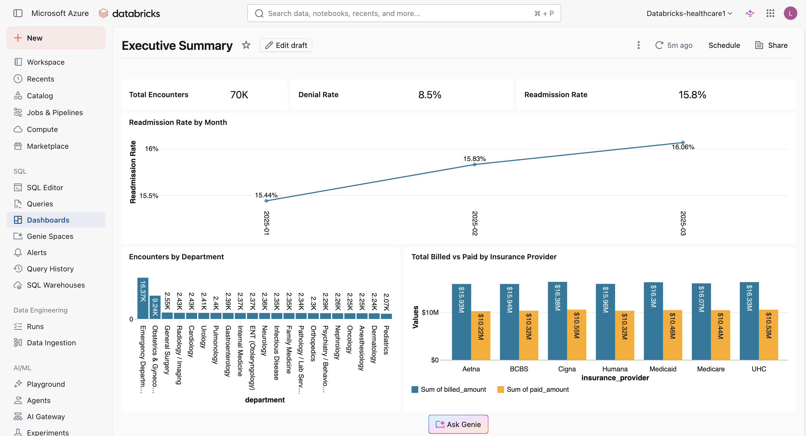

# 🏥 Healthcare Data Engineering & Analytics Platform
### Enterprise Case Study: Modernizing Healthcare KPI Reporting with Azure & Databricks

---

## 📐 Architecture Overview

---

## 1. Executive Summary

Healthcare organizations often struggle with fragmented data sources, inconsistent KPI definitions, and delayed reporting for operational and clinical decision-making.

This project simulates an enterprise-grade data platform designed to unify healthcare data and deliver trusted, near-real-time executive insights using a modern lakehouse architecture.

The solution centralizes patient, encounter, provider, and claims data into a governed pipeline and delivers dashboards across four domains: Executive Summary, Clinical Quality, Revenue Cycle, and Provider Performance.

---

## 2. Business Problem

Healthcare stakeholders faced the following challenges:

- KPI inconsistencies (e.g., readmission rate definition varied across reports)
- Delayed reporting cycles for executive dashboards
- Fragmented datasets across operational systems
- Limited visibility into provider and clinical performance trends

#### Business Objective: Build a unified analytics platform that:
- Standardizes healthcare KPIs across all departments
- Improves data reliability and traceability
- Enables faster executive decision-making

---

## 3. Solution Overview

A modern medallion architecture (Bronze → Silver → Gold) was implemented using Azure Data Factory, Azure Blob Storage, Azure SQL Database, and Databricks.

#### Architecture Flow

| Layer | Tool | Purpose |
|---|---|---|
| Ingestion | Azure Data Factory | Orchestrate and pull raw data from healthcare source systems |
| Bronze | Azure Blob Storage | Raw storage: data landed as-is, no transformations |
| Silver | Azure SQL Database | Cleaning, validation, and standardization |
| Gold | Azure SQL Database | KPI aggregation and business-ready datasets |
| Executive Analytics | Databricks | Reads from Gold layer: powers Executive Summary analysis |
| Reporting | Power BI | Dashboards for all three repoting domains |

---

## 4. Pipeline Implementation

**Master Bronze Load Pipeline (Azure Data Factory)**

**Bronze Layer Overview**

---

## 5. Databricks Implementation (Gold Layer — Executive Summary)

Databricks connects to the Gold layer in Azure SQL Database to power the Executive Summary analysis and KPI exploration:

- Developed PySpark-based transformations for KPI aggregation
- Designed and optimized the `fact_monthly_kpis` gold table
- Used Delta Lake for reliability, versioning, and performance optimization
- Integrated Databricks SQL endpoints for BI consumption
- Leveraged Databricks Genie to accelerate exploration, validate logic, and refine KPI definitions during development

**Databricks Executive Summary (Gold Layer)**

---

## 6. Gold Layer Data Model

**gold_fact_clinical** includes:
- `readmitted_flag`, `total_diagnoses`, `total_medications`
- `total_procedures`, `clinical_sk`, `primary_dx_code`

**gold_fact_claims** — revenue and denial tracking

**Dimension tables:** `gold_dim_patient`, `gold_dim_provider`, `gold_dim_date`

---

## 7. Key Design Decisions

| Decision | Rationale |
|---|---|
| Azure Blob Storage for Bronze | Cost-effective raw landing zone; no transformation needed at ingestion |
| Azure SQL Database for Silver & Gold | Structured, queryable storage ideal for validated and aggregated healthcare data |
| Databricks scoped to Executive Summary | Reserved for complex KPI exploration and AI-assisted analysis at the Gold layer |
| KPI logic centralized in Gold | Prevents metric fragmentation across downstream reports |
| Power BI as reporting layer | Familiar to healthcare stakeholders; connects directly to Azure SQL endpoints |

---

## 📊 Dashboard Previews

**Executive Summary** — KPI overview across 70K encounters and $437M billed

**Clinical Quality** — Length of stay, readmission rates, and chronic conditions by department

**Revenue Cycle** — Denial trends by payer, appeal success rate, and insurance provider comparison

---

## 8. Key Metrics Delivered

| KPI | Value |
|---|---|
| Total Encounters Analyzed | 70,000 |
| Total Billed | $437M |
| Overall Denial Rate | 8.5% |
| Readmission Rate (Mar 2025) | 16.1% (trending up from 15.4%) |
| Appeal Success Rate | 30.89% |
| Insurance Providers Tracked | 8 (Cigna, UHC, Medicare, Medicaid, Humana, BCBS, Aetna) |
| Dashboard Pages | 4 (Executive Summary, Clinical Quality, Revenue Cycle, Provider Performance) |

---

## 9. Key Findings

- Readmission rates trended upward Jan–Mar 2025 (15.4% → 16.1%), flagging a potential quality concern for clinical review
- Oncology and Infectious Disease had the highest denial rates (~9.7–9.9%)
- Psychiatry/Behavioral Health had the longest average length of stay (~6 days)
- Cigna had the largest gap between billed ($16.38M) and paid ($10.55M) — a ~36% reduction worth investigating

This platform demonstrates a production-ready approach to healthcare analytics that reduces time-to-insight for executive stakeholders.

---

## 10. Technologies Used

| Category | Tools |
|---|---|
| Orchestration | Azure Data Factory |
| Raw Storage | Azure Blob Storage |
| Silver & Gold Storage | Azure SQL Database |
| Executive Analytics | Databricks (PySpark, Delta Lake, SQL) |
| AI-Assisted Development | Databricks Genie |
| Visualization | Power BI |

---

## License

This project is licensed under the [MIT LICENSE](LICENSE). You are free to use, modify, and share this project with proper attribution.

---

## 👤 About Me

I'm **Sylvie Linda**, a data engineer specializing in cloud-native healthcare data pipelines on Azure. I design end-to-end solutions from raw ingestion through medallion architecture transformations to executive-ready KPI dashboards using Azure Data Factory, Azure SQL Database, Databricks, and Power BI.

This project reflects my focus on building scalable, governed data platforms that turn fragmented healthcare data into trusted insights for clinical and operational decision-making.

📫 [LinkedIn](https://www.linkedin.com/in/sylvie-linda-85087416a/) | 📧 Lindasylvie6@email.com
